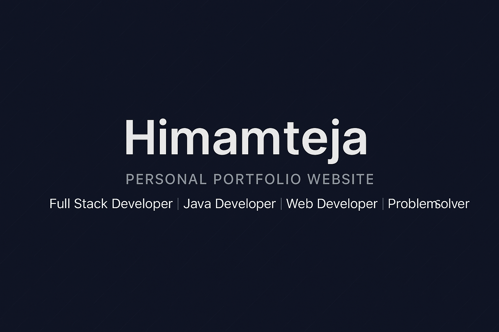
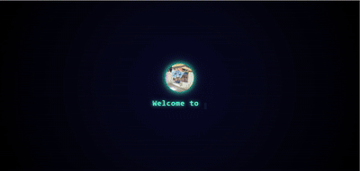
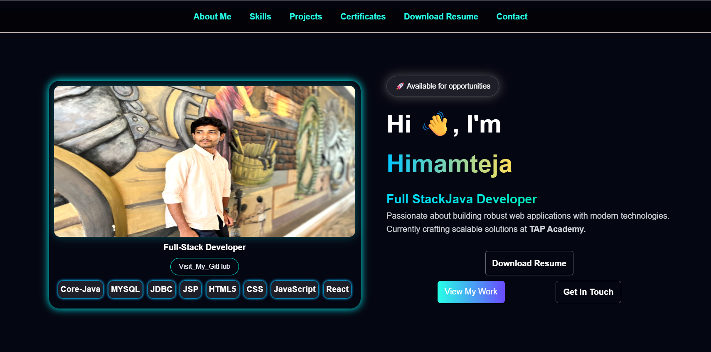
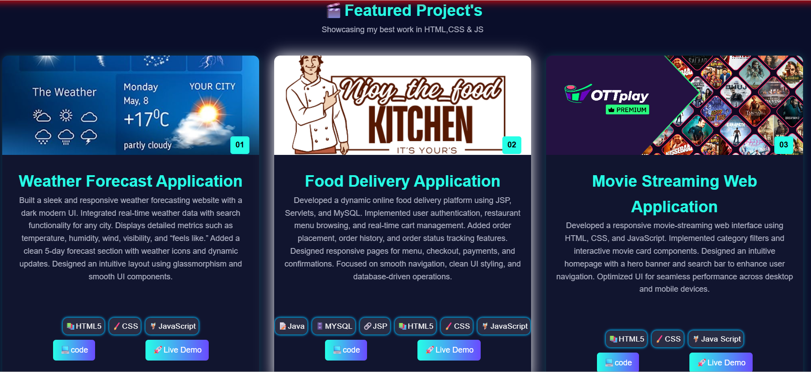
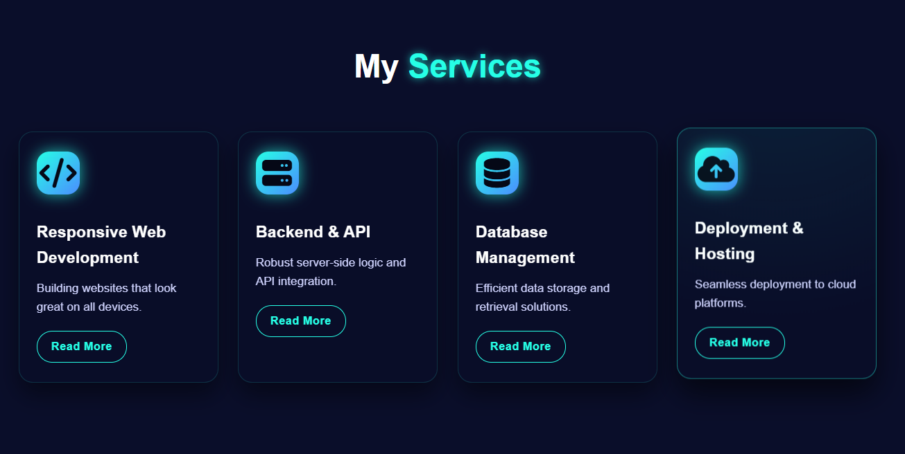

  

<h1 align="center">🌟 Himamteja – Personal Portfolio Website</h1>

  Full Stack Developer | Java Developer | Web Developer | Problem Solver

---

## 🔰 Badges

  
  
  
  
  

---

## 🧑‍💻 About Me

Hi, I’m **Himamteja** — a passionate developer who builds clean, responsive, and user-friendly applications.  
This portfolio showcases my skills, projects, and journey from Mining Engineering to IT development.

---

## 📹 Demo video

  

[🎥 Click here to watch the Demo Video](portfolio/demo.mp4)

## 📌 Sections Included

- **Home** – Intro & tagline  
- **About** – Education, skills, background  
- **Skills** – Tech & soft skills  
- **Projects** – All my major applications  
- **Experience** – Timeline (if added)  
- **Services** – What I can do  
- **Contact** – Social links  
- **Resume Download** – One-click access  

---

## 🛠️ Tech Stack

- **HTML5**
- **CSS3**
- **JavaScript**
- **Boxicons / FontAwesome**
- **ScrollReveal.js**
- **Responsive Web Design**

---

## 📸 Screenshots
> All screenshots are resized to keep the README clean and neat.

## 📸 Screenshots

<table>
  <tr>
    <td align="center">
      
      
🏠 Main Section

    </td>
    <td align="center">
      
      
📝Projects Section

    </td>
    <td align="center">
      
      
⚙️ Service Section

    </td>
  </tr>
</table>

---

## 🚀 Getting Started

## Clone Repo
Git Clone 👉 https://github.com/himamteja/My_Porfolio/

---

## 📂 Project Structure

---

  ⭐ If you like this project, don't forget to star the repo! ⭐

---

## 🎉 Thank you for visiting my Project-repo!  

  

